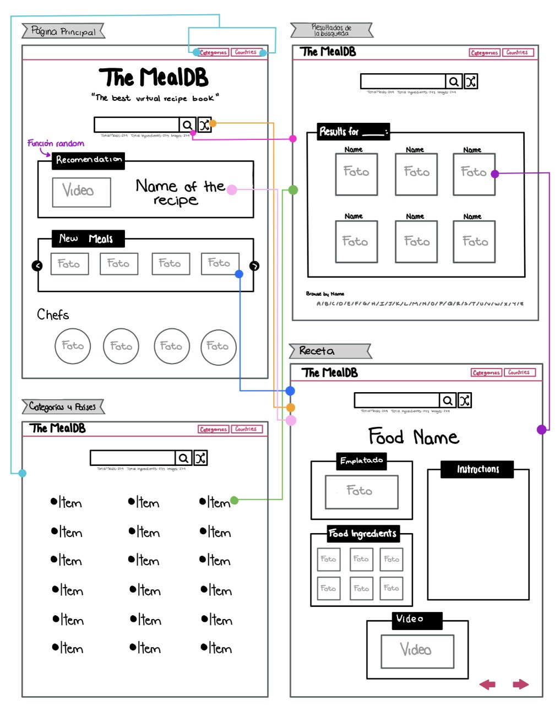

<<<<<<< HEAD
# Proyecto Fase 2 
Proyecto Final de la Fase 2 BEDU-Santander

## Integrantes del equipo
* Castillo Del Valle Gabriela Aideé
* Galíndez Cortés Marco Antonio
* Karina Lizeth Ortiz Muñoz
* García Eulogio Lourdes
* Juliet Guadalupe Quintero Rocha

## Instrucciones generales
* Mostrar en la UI un input para ingresar texto y un botón para generar la búsqueda.
* Utilizar la siguiente API para obtener los resultados: [Free Meal API](https://www.themealdb.com/api.php)
* Mostrar los resultados usando las imágenes de las recetas.
* Al seleccionar una imagen se deben desplegar los detalles de la receta, es decir, los ingredientes y las instrucciones.
* Mostrar en la UI un botón secundario para desplegar una receta aleatoria.

Nota: El acomodo de todos los elementos junto con el diseño es completamente libre, se pueden usar librerías que ayudan con la UI como Bootstrap, Foundation, Materialize, etc.

## Primera parte (09/08/21)
La primera parte de ese proyecto y consiste en dejar listo el ambiente de desarrollo:
* Desarrolla los mockups de la aplicación, esto te permitirá visualizar cómo se van a acomodar todos los elementos mucho antes de crear el código. Es parte fundamental en el desarrollo del software.
* Instalar y configurar Webpack, Babel y Webpack Dev Server.
* Instalar las librerías que se vayan a utilizar (Bootstrap, Materialize, Foundation, etc.).
* Configurar los loaders necesarios para los estilos, se puede utilizar CSS o SASS.

## Descripcion
Como parte de nuestra visión, hemos desarrollado los mockups contemplando la realizacion de nuestro sistema en 2 fases, la primera con las caracteristicas indicadas en las **instrucciones generales** y la segunda con una version avanzada, la cual será desarrollada al completar la primera fase.

## Mockups



En los mockups se pueden visualizar las pantallas contempladas para la entrega de este proyecto. Los componentes titulados *Categories text* y *Countries* forman parte de la fase 2 mencionada anteriormente.


# Desarrollo:

La carpeta con las configuraciones se encuentra en : [Carpeta del proyecto](https://github.com/lizeth9797/proyectoFase2/tree/produccion/entorno)

Dependencias principales: 
  * Webpack y Webpack Dev Server
  * Babel
  * Bootstrap

Loaders: 
  * style-loader
  * css-loader
  * babel-loader
  * html-loader
  * sass-loader
  * postcss-loader
 
Plugins:
  * html-webpack-plugin
  
Dependencias adicionales:
  * @babel/core
  * @babel/preset-env
  * @popperjs/core

=======
# Rama Preproducción

## Getting started

1. Instalar dependencias
``` console 
npm i
```

2. Iniciar el proyecto
``` console 
npm run start
```


### CASOS DE PRUEBA
1. Recommendations (platillo aleatorio)
    - Se muestra video de platillo
    - Se muestra titulo de platillo
2. Header
    - El sistema redirecciona a la pagina results.html al seleccionar la opción "A-Z"
3. Barra de búsqueda
    - Al seleccionar el botón "Random" el sistema muestra la pantalla recipe.html con la descripción de la receta
    - Al insertar texto y seleccionar el botón "Search" el sistema muestra la pantalla results.html con las coincidencias encontradas
4. Página results
    - El sistema muestra resultados de un platillo aleatorio
    - El sistema muestra las coindidencias de la búsqueda realizada en la página principal
    - El sistema filtra los platillos por letra
5. Página recipe
    - El sistema muestra el titulo 
    - El sistema muestra la imagen
    - El sistema muestra las instrucciones
    - El sistema muestra los ingredientes
    - El sistema muestra el video
>>>>>>> preproduccion
