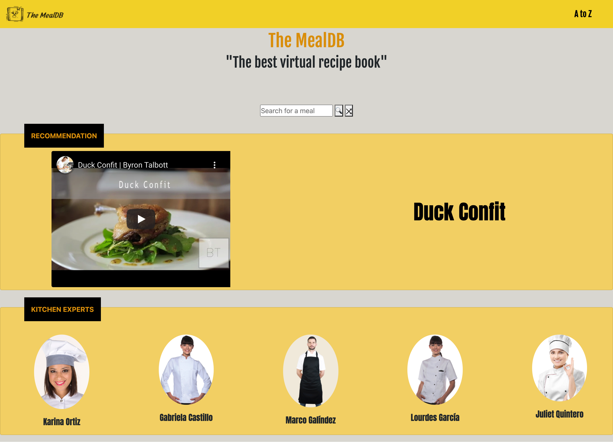
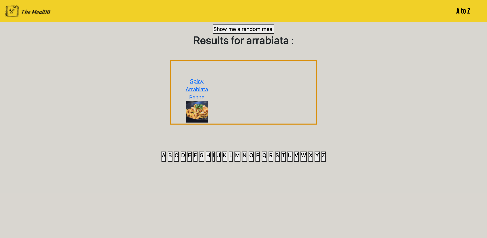
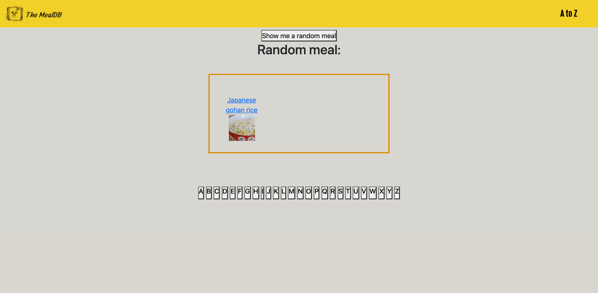
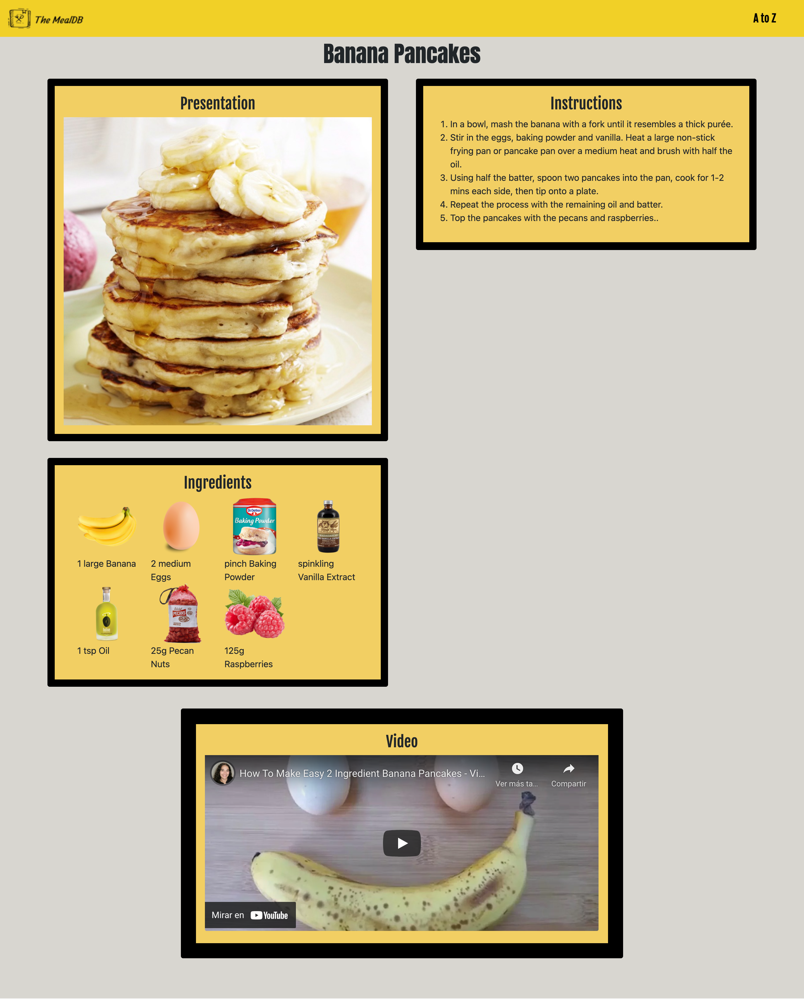
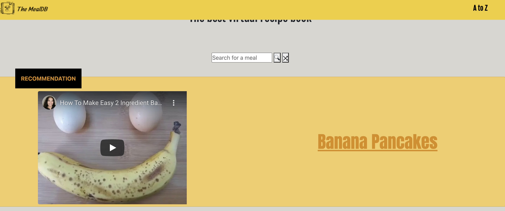

# Proyecto Fase 2 
Proyecto Final de la Fase 2 BEDU-Santander

~~~
https://themealdb-bedu.netlify.app/ 
~~~

## Integrantes del equipo
* Castillo Del Valle Gabriela Aideé
* Galíndez Cortés Marco Antonio
* Karina Lizeth Ortiz Muñoz
* García Eulogio Lourdes
* Juliet Guadalupe Quintero Rocha


## Getting started

1. Instalar dependencias
``` console 
npm i
```

2. Iniciar el proyecto
``` console 
npm run start
```


### USER STORIES
- Buscar Recetas
- Mostrar detalle de receta seleccionada
- Botón para mostrar receta aleatoria








### CASOS DE PRUEBA 
1. Recommendations (platillo aleatorio)
    - Se muestra video de platillo
    - Se muestra titulo de platillo
2. Header
    - El sistema redirecciona a la pagina results.html al seleccionar la opción "A-Z"
3. Barra de búsqueda
    - Al seleccionar el botón "Random" el sistema muestra la pantalla recipe.html con la descripción de la receta
    - Al insertar texto y seleccionar el botón "Search" el sistema muestra la pantalla results.html con las coincidencias encontradas
4. Página results
    - El sistema muestra resultados de un platillo aleatorio
    - El sistema muestra las coindidencias de la búsqueda realizada en la página principal
    - El sistema filtra los platillos por letra
5. Página recipe
    - El sistema muestra el titulo 
    - El sistema muestra la imagen
    - El sistema muestra las instrucciones
    - El sistema muestra los ingredientes
    - El sistema muestra el video


## Colección de Postman:
https://www.getpostman.com/collections/2fd68396cec6ab60bd5a


## Mockups


## Desarrollo:

Dependencias principales: 
  * Webpack y Webpack Dev Server
  * Babel
  * Bootstrap

Loaders: 
  * style-loader
  * css-loader
  * babel-loader
  * html-loader
  * sass-loader
 
Plugins:
  * html-webpack-plugin
  
Dependencias adicionales:
  * @babel/core
  * @babel/preset-env
  * @popperjs/core
